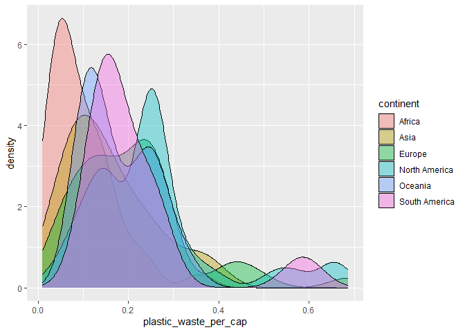
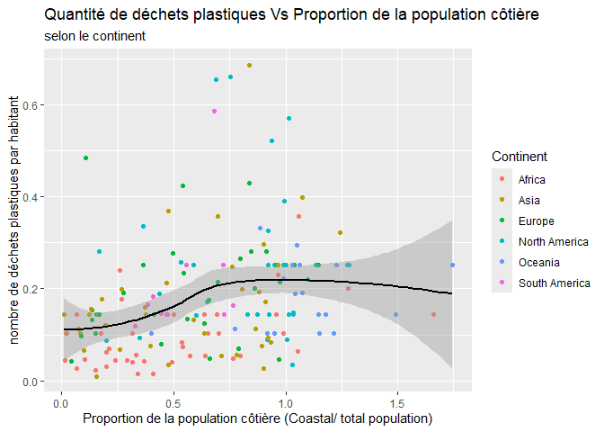

Lab 02 - Plastic waste
================
Derrick KOUAME
13/09/2025

## Chargement des packages et des données

``` r
library(tidyverse) 
```

``` r
plastic_waste <- read_csv("data/plastic-waste.csv")
```

Commençons par filtrer les données pour retirer le point représenté par
Trinité et Tobago (TTO) qui est un outlier.

``` r
plastic_waste <- plastic_waste %>%
  filter(plastic_waste_per_cap < 3.5)
```

## Exercices

### Exercise 1

``` r
ggplot(plastic_waste,
      aes(x = plastic_waste_per_cap)) +
  geom_histogram (binwidth = 0.2) +
  facet_wrap(~ continent)
```

<!-- -->

on observe que l’Afrique et l’Asie produisent très peu de déchets
plastiques par habitants, avec des distributions concentrées près de 0.
L’Europe et l’Amérique du Nord présentent aussi des valeurs faibles en
moyenne, mais avec une variabilité un peu plus grande. En revanche,
L’Océanie et l’Amérique du Sud affichent des niveaux plus élevés de
déchets plastiques par habitant dans certains pays, mais restent
toujours dans la moyenne.

### Exercise 2

``` r
ggplot(plastic_waste,
       aes(x = plastic_waste_per_cap,
           fill = continent)) +
  geom_density(adjust = 1,
               alpha = 0.4)
```

<!-- -->

le reglage de la couleur (color et fill) et le réglage de la
transparence (alpha) ne se trouvent pas au même endroit car, dans aes,
nous sommes dans le mapping et celui-ci détermine la propriété en
fonction d’une donnée. Tandis que, dans le geom_density(), nous sommes
dans le setting, la propriété est ici appliquée à tout le graphique.

### Exercise 3

Boxplot:

``` r
ggplot(plastic_waste,
       aes(x = continent, y = plastic_waste_per_cap)) +
  geom_boxplot()
```

<!-- -->

Violin plot:

``` r
ggplot(plastic_waste,
       aes(x = continent, y = plastic_waste_per_cap)) +
  geom_violin()
```

<!-- -->

Le violin plot met en évidence les formes de distributions différentes
selon les continents: l’Afrique et l’Asie sont très concentrés vers le
bas (faible production de déchets), alors que l’Europe et l’Amerique du
Nord sont plus dispersées et montent vers le haut. quant au boxplot, il
resume bien statisquement. Il revele que la médiane de l’Afrique est
plus basse que celle de l’Europe et de l’Amérique du Nord.

### Exercise 4

``` r
ggplot(plastic_waste,
       aes(x = plastic_waste_per_cap, y = mismanaged_plastic_waste_per_cap,
           color = continent)) +
  geom_point() 
```

<!-- -->

La relation entre la quantité de dechets et la quantité de déchets non
gérés est positive. Quand la quantité de dechets plastiques augmente, la
quantité de déchets plastiques non gérés a tendance à augmenter aussi.
Cependant, la relation n’est pas parfaitement linéaire. Certains pays,
l’Afrique et l’Asie produisent peu de dechets mais les gèrent mal.
Tanadis que, les autres produisent assez, mais les gèrent bien.

### Exercise 5

``` r
ggplot(plastic_waste,
       aes(x = plastic_waste_per_cap, y = total_pop)) +
  geom_point()
```

    ## Warning: Removed 10 rows containing missing values or values outside the scale range
    ## (`geom_point()`).

<!-- -->

``` r
ggplot(plastic_waste,
       aes(x = plastic_waste_per_cap, y = coastal_pop)) +
  geom_point()
```

<!-- -->

Il n’existe pas de relation forte entre la quantité de déchets
plastiques par habitant et le nombre d’habitants (total ou cotiers). Les
deux nuages de points montrent une dispersion sans tendance, donc aucune
des deux relations n’est plus forte que l’autre.

## Conclusion

Recréez la visualisation:

``` r
 plastic_waste_coastal <- plastic_waste %>% 
  mutate(coastal_pop_prop = coastal_pop / total_pop) %>%
  filter(plastic_waste_per_cap < 3)
ggplot(plastic_waste_coastal,
       aes(x = coastal_pop_prop, y = plastic_waste_per_cap, color = continent)) +
  geom_point() +
  geom_smooth(method = loess, se = TRUE,  color = "black") +
  labs(title = "Quantité de déchets plastiques Vs Proportion de la population côtière",
       subtitle = "selon le continent", x = "Proportion de la population côtière (Coastal/ total population)",
       y = "nombre de déchets plastiques par habitant",
       color = "Continent")
```

    ## `geom_smooth()` using formula = 'y ~ x'

    ## Warning: Removed 10 rows containing non-finite outside the scale range
    ## (`stat_smooth()`).

    ## Warning: Removed 10 rows containing missing values or values outside the scale range
    ## (`geom_point()`).

<!-- -->

On observe une légère tendance à la hausse de ls quantité de déchets
plastiques par habitant lorsque la Proportion de la population côtière
augmente, mais cette relation reste faible. La courbe se stabilise puis
diminue légèrement, ce qui montre que la proportion de population
côtière n’explique pas à elle seule la production de déchets plastiques.
